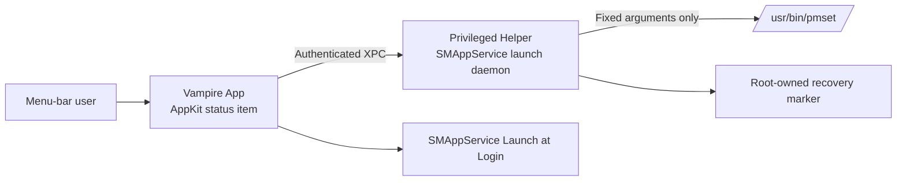

# Vampire Menu Bar App Design

**Status:** Approved by Grant on 2026-08-31; portable-hardware and Vampire brand amendments approved on 2026-08-31
**Owner:** Grant Isom  
**Minimum OS:** macOS 13 Ventura  
**Distribution:** Direct, outside the Mac App Store  
**Source repository:** `/Users/grantisom/Developer/insomnia`

## Objective

Create a lightweight native macOS menu-bar app that reproduces these existing commands:

```sh
sudo pmset -a disablesleep 1
sudo pmset -a disablesleep 0
```

The app must prevent lid-close sleep while Vampire is On, restore normal lid-close sleep when it is Off, and require privileged approval only during initial setup.

## Brand Identity

- The user-facing product name is **Vampire**.
- The app icon is a simplified deep-purple coffin silhouette with one warm-cream bat emblem on a transparent canvas. It has no enclosing rounded-square tile or perimeter border.
- The menu-bar image is a monochrome moon-and-stars mark while Off and a bat silhouette while On, suitable for light and dark menu bars.
- The menu uses one native checkable `Keep Mac Awake with Lid Closed` setting; the former Lullaby wording is removed.
- Existing bundle IDs, helper labels, XPC names, target/module names, and recovery paths containing `insomnia` remain stable to preserve the approved helper security contract and macOS approval state.

## Success Criteria

- A teammate can drag the app into `/Applications`, launch it, and complete one macOS approval flow.
- Later On and Off toggles do not request an administrator password.
- On maps to `pmset -a disablesleep 1` and Off maps to `pmset -a disablesleep 0`.
- Normal quit, app crash, helper crash, and Mac restart all restore `disablesleep 0`.
- The app never reports On until the privileged operation exits successfully and its deterministic verification policy passes.
- The app has no Dock icon, regular window, network access, analytics, updater, or third-party runtime dependency.
- The release is a universal, Developer ID-signed, hardened, notarized build for macOS 13 or newer.

## Non-Goals

- Preventing ordinary idle sleep, display sleep, or screen locking. Lungo already owns that use case.
- App Store publication.
- Timers, schedules, keyboard shortcuts, per-power-source rules, or automatic activation.
- Remote control, telemetry, analytics, or automatic updates.
- Supporting macOS 12 or older.

## Approaches Considered

### 1. AppKit app with an `SMAppService` launch daemon

**Chosen.** A native menu-bar app registers a bundled root helper once, then communicates with it through a restricted XPC interface. This is Apple's current architecture for a bundled launch daemon and satisfies the one-time approval requirement.

### 2. App plus installer-package launch daemon

Rejected. Runtime behavior would be simple, but installation, updates, and removal would be heavier than a self-contained application bundle.

### 3. AppleScript privilege prompt around `pmset`

Rejected. It is the smallest implementation but requires an administrator prompt on every toggle.

### 4. `caffeinate` or an I/O Kit power assertion

Rejected. These prevent idle sleep but do not reproduce the required lid-close behavior.

## Architecture

The system has three narrowly scoped components:

1. **Vampire app:** owns the menu-bar interface, setup flow, state presentation, Launch at Login preference, and one live XPC session.
2. **Privileged helper:** a root launch daemon registered with `SMAppService`. It retains its stable Insomnia-era identifiers, authenticates the connecting app, owns recovery, and exposes only status, enable, and disable operations.
3. **Power-setting adapter:** invokes `/usr/bin/pmset` directly with fixed arguments. It never invokes a shell or accepts caller-supplied executable paths or arguments.



### Identifiers

- Main app bundle identifier: `co.groundwork-ai.insomnia`
- Helper label and Mach service: `co.groundwork-ai.insomnia.helper`
- Recovery directory: `/Library/Application Support/Insomnia/`
- Recovery marker: `/Library/Application Support/Insomnia/active.plist`

## Privileged Setup

1. The user moves Vampire to `/Applications` and opens it.
2. The app explains that macOS approval is required once to change lid-close sleep behavior.
3. The app registers its bundled launch daemon with `SMAppService`.
4. If macOS reports that approval is required, the app offers a button that opens the relevant System Settings location.
5. The app observes helper status and does not enable its main toggle until the helper is available.
6. The Setup & Status action later shows whether the helper is enabled and provides a Remove Helper action.

Removing the helper first restores `disablesleep 0`, waits for verification, unregisters the daemon, and only then reports successful removal.

## XPC Contract and Security

The XPC interface contains no generic command execution method. Its operations are:

```text
getStatus() -> helper version, readiness, and current app-managed state
setInsomniaEnabled(true) -> success or typed error
setInsomniaEnabled(false) -> success or typed error
```

Before activating its Mach-service listener, the helper calls `NSXPCListener.setConnectionCodeSigningRequirement(_:)`, available on macOS 13, with a requirement that pins the caller to bundle identifier `co.groundwork-ai.insomnia` and the same Developer ID team as the helper. The helper reads its own Team Identifier through the Security framework and builds the requirement from that verified runtime identity. macOS rejects a nonmatching connection before the listener delegate sees it. Rejections are logged through Apple's unified logging system without recording personal data.

The helper runs only these fixed commands:

```text
/usr/bin/pmset -a disablesleep 1
/usr/bin/pmset -a disablesleep 0
/usr/bin/pmset -g custom
```

No untrusted value is interpolated into either invocation. The app is not sandboxed because it must register and communicate with the privileged helper, but Hardened Runtime is enabled for every executable in the bundle.

The app and helper perform the same local hardware preflight. Legacy model identifiers beginning with `MacBook` are supported directly. Modern model identifiers beginning with `Mac` are supported only when I/O Kit reports a power source of type `kIOPSInternalBatteryType`. Other model families and `Mac` models without an internal battery show Unsupported. This avoids a fixed model whitelist while excluding desktop Macs and external UPS power sources.

## State and Recovery

The app presents five states: Setup Required, Unsupported, Off, On, and Error. The helper is authoritative for state transitions.

Every helper launch first runs `pmset -a disablesleep 0` before accepting an XPC connection. This makes helper restart and system reboot fail safe even if the recovery marker is missing or damaged. If normalization fails, the helper remains in Error and accepts only status and retry-Off requests.

For each write, successful execution means `/usr/bin/pmset` exits with status `0`. The helper then runs `pmset -g custom`. If that output contains `disablesleep`, every reported power profile must equal the requested value. If macOS omits this undocumented key, the successful write is accepted only on a supported MacBook model; the signed release checklist then supplies the required physical lid-close verification.

### Turn On

1. Create the root-owned recovery marker atomically with permissions that prevent non-root modification.
2. Run `pmset -a disablesleep 1`.
3. Require exit status `0` and apply the defined `pmset -g custom` verification policy.
4. Report On to the app.
5. If any step fails, run `pmset -a disablesleep 0`, remove the marker if recovery succeeds, and return a typed error.

### Turn Off

1. Run `pmset -a disablesleep 0`.
2. Require exit status `0` and apply the defined `pmset -g custom` verification policy.
3. Remove the recovery marker.
4. Report Off to the app.

### Normal Quit

The app requests Off, waits for the helper's acknowledgement, then quits. If the request fails, it remains open in Error and offers Retry. The normal Quit action never knowingly exits while On or while recovery is unresolved.

### App Crash or Force Quit

The helper observes invalidation of the app's XPC connection. If the recovery marker exists, it restores `disablesleep 0` and removes the marker.

### Helper Crash

The app reconnects to the helper's launchd-managed Mach service. During startup, the helper restores `disablesleep 0` before accepting connections, then removes any stale recovery marker and starts in Off.

### Mac Restart

The registered daemon runs during startup and restores `disablesleep 0` before accepting connections. It then removes any stale recovery marker. Vampire never resumes On automatically after login.

### Recovery Failure

If `pmset -a disablesleep 0` fails, the helper retains the marker and emits an error through unified logging. The app shows Error when it reconnects and offers Retry. The helper retries recovery on every subsequent start; it does not silently clear the marker.

## Menu-Bar Experience

Vampire uses an `NSStatusItem` and `NSMenu`, with `LSUIElement` enabled so it does not appear in the Dock.

```text
Keep Mac Awake with Lid Closed    ✓/off
──────────────────────────────────
Launch at Login                   ✓/off
Setup & Status…
──────────────────────────────────
About Vampire
Quit Vampire                      ⌘Q
```

The primary item is a single native checkable setting. Its checkmark is On only while lid-close sleep is disabled. Setup Required replaces it with `Set Up Vampire…`; Unsupported replaces it with a disabled `Vampire Requires a MacBook`; Error replaces it with `Restore Normal Lid Sleep…`. The status item's accessibility label continues to announce `Vampire: On`, `Vampire: Off`, or the applicable exceptional state. The custom template mark shows a crescent with two stars while Off and a broad-winged bat while On. Error adds the system warning badge treatment and exposes the concise error detail as the recovery item's tooltip.

First launch uses a single native explanatory alert before beginning setup. Setup Required, Unsupported, and Error states never visually resemble On.

## Launch at Login

Launch at Login uses `SMAppService.mainApp`. It appears as a checkbox in the menu, defaults to Off, and reflects the operating system's actual registration status. Launching at login starts the app in Off and never enables Vampire automatically.

## Error Model

Internal errors are mapped to actionable user-facing categories:

- **Setup required:** register or approve the helper.
- **Unsupported Mac:** explain that Vampire requires a MacBook with a built-in lid.
- **Helper unavailable:** retry the connection or open Setup & Status.
- **Unauthorized client:** treat as a security failure and remain Off.
- **Command failed:** show the `pmset` exit status without exposing unrelated process data.
- **Verification failed:** remain in Error until Off recovery succeeds.
- **Recovery required:** retry `disablesleep 0`; never claim Off while recovery is unresolved.

Errors are logged with `Logger` using the subsystem `co.groundwork-ai.insomnia`. No log contains passwords, command input, usernames, file contents, or device identifiers.

## Project Structure

Production source code lives in a dedicated Git repository at `/Users/grantisom/Developer/insomnia`, outside the Obsidian vault. The repository will contain one Xcode project with these targets:

```text
Insomnia/                 AppKit menu-bar application
InsomniaHelper/           Privileged launch daemon
InsomniaShared/           XPC protocol and shared value types
InsomniaTests/            App state and UI-model unit tests
InsomniaHelperTests/      Helper, recovery, and command-adapter unit tests
InsomniaIntegrationTests/ Signed app/helper integration checks
```

The Obsidian project keeps product context, decisions, and planning. Generated build products, signing assets, and source code do not live in the vault.

## Distribution

- Archive a universal Apple Silicon and Intel build with macOS 13 as the deployment target.
- Sign the app, helper, and embedded components with Developer ID Application using one Apple Developer team.
- Enable Hardened Runtime and secure timestamps.
- Validate nested code signatures before notarization.
- Submit the disk image through Apple's current notary service and staple the ticket.
- Verify the final disk image with `codesign`, `spctl`, and `stapler` before sharing.
- Distribute a disk image containing Vampire and an Applications-folder shortcut.

The current Mac has Command Line Tools but not full Xcode. Full Xcode is an implementation prerequisite for creating, archiving, signing, and notarizing the release.

## Testing Strategy

### Automated tests

- App state machine transitions among Setup Required, Off, On, and Error.
- Menu labels and enabled actions match each state.
- Fixed command construction cannot accept arbitrary paths or arguments.
- On writes the recovery marker before changing `pmset`.
- Off removes the marker only after successful restoration.
- Failed On attempts perform Off recovery.
- XPC invalidation triggers Off recovery when the marker exists.
- Helper startup restores Off before accepting requests, with and without a stale marker.
- Failed recovery retains the marker.
- Launch at Login reflects actual `SMAppService` status and never activates Vampire.
- Unauthorized XPC clients are rejected.

Normal tests use a fake command adapter and a temporary recovery-marker store. They never modify the development Mac's real power settings.

### Signed integration tests

- The notarization candidate connects only to its bundled signed helper.
- A test client with the wrong signing identity is rejected.
- Helper registration, approval-state detection, enable, disable, and removal work from `/Applications`.
- Killing the app restores Off.
- Killing the helper restores Off after `launchd` relaunches it.
- Restarting the Mac with Vampire On restores Off before the next login session uses the app.

### Manual release checks

- Fresh install on a clean macOS 13-or-newer account.
- First-run approval flow.
- On and Off without repeated administrator prompts.
- Actual MacBook lid-close behavior while On and Off.
- Launch at Login enabled and disabled.
- Final disk image accepted by Gatekeeper on a Mac that did not build it.

## Definition of Done

- All automated tests pass.
- All signed integration and manual release checks pass.
- The app and helper recover to `disablesleep 0` across every specified failure path.
- The final disk image is signed, notarized, stapled, and Gatekeeper-accepted.
- A teammate completes first-run setup and toggles On and Off without developer intervention or repeated administrator prompts.
- The project README documents install, first-run approval, safe removal, troubleshooting, and the exact lid-close-only scope.

## References

- [Apple Service Management](https://developer.apple.com/documentation/servicemanagement/)
- [Apple: Notarizing macOS software before distribution](https://developer.apple.com/documentation/security/notarizing-macos-software-before-distribution)
- [Apple: Preparing your app for distribution](https://developer.apple.com/documentation/xcode/preparing-your-app-for-distribution)
- Local `pmset(1)` manual, inspected 2026-08-28
